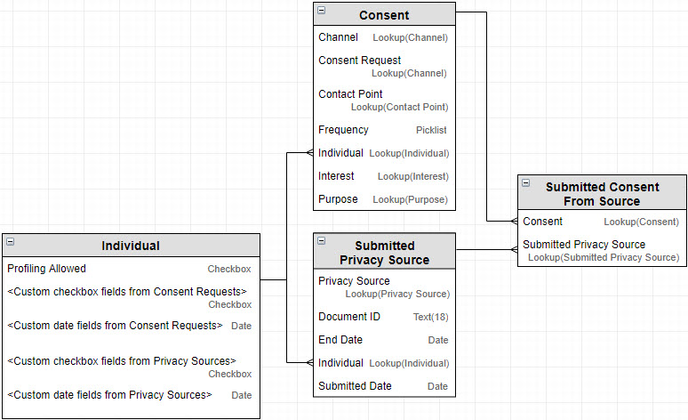

# Data saved after submit button clicked

Below you can find Objects Diagram. Records of those objects are created/updated during Privacy Page submission:

When Data Subject clicks a _Submit & Confirm_ button on Privacy Page the following updates in Salesforce Database happen:

### Submitted Privacy Source

* If the Privacy Page submitted first time then a new _Submitted Privacy Source_ record is created. If the same Privacy Page submitted again then instead of creating a new _Submitted Privacy Source_ record an existing _Submitted Privacy Source_ record is updated. The following fields of the _Submitted Privacy Source_ record are set:

| **Privacy Source** | Privacy Page submitted by current Data Subject. |
| --- | --- | --- | --- |
| **End Date** | Date when permissions given by current Data Subject will be expired. This date is identified by submitted date and a _Permissions Period_ which was set in _Setup_ of the Privacy Page. If _Permissions Period_ is not set then the _End Date_ field will be empty. |
| **Individual** | Individual which represents a current Data Subject. |
| **Submitted Date** | Date when Data Subject submitted the Privacy Page. |

### Consent

* For each consent request which Data Subject selected on the Privacy Page a new _Consent_ record is created. If consent for the same _Consent Request_ was given by the Data Subject before then instead of creating the new _Consent_ record an existing one is updated. The following fields of the _Consent_ record are set:

| **Channel** | Channel of selected consent request. |
| --- | --- | --- | --- | --- | --- | --- |
| **Consent Request** | Reference to the consent request which was selected. |
| **Contact Point** | This field is set differently depend on _Point of Contact_ options preselected on _Setup_ \| _Consent Requests_ subtab for the consent request:  |
| **Frequency** | This field is set differently depend on _Frequency_ options preselected on _Setup_ \| _Consent Requests_ subtab for the consent request:  |
| **Individual** | Individual which represents a current Data Subject. |
| **Interest** | _Interest_ option which was preselected on _Setup_ \| _Consent Requests_ subtab for the consent request. If _-- Any Interest --_ option was preselected then this field will be blank. |
| **Purpose** | _Purpose_ option which was preselected on _Setup_ \| _Consent Requests_ subtab for the consent request. If _-- Any Purpose --_ option was preselected then this field will be blank. |

### Individual

* The following fields of _Individual_ record are set:

| **Profiling Allowed** | If Data Subject activated Profiling toggle then this checkbox will be checked. Otherwise unchecked. |
| --- | --- | --- | --- | --- |
|  _**&lt;Custom checkbox fields from Consent Requests&gt;**_ | If Data Subject selected some of consent requests which were mapped to Individual's object checkbox fields by _Individual Object's Checkbox Field_ setting on _Setup_ \| _Consent Requests_ subtab then the checkbox field will be checked. Otherwise it will be unchecked. |
|  _**&lt;Custom date fields from Consent Requests&gt;**_ | If Data Subject selected some of consent requests which were mapped to Individual's object date fields by _Individual Object's Date Field_ setting on _Setup_ \| _Consent Requests_ subtab then the date field will be set with an _End Date_ value of _Submitted Privacy Source_. Otherwise it will be blank. |
| _**&lt;Custom checkbox field from Privacy Source&gt;**_ | If the submitted privacy source was mapped to Individual's object checkbox field then the checkbox field will be checked. |
| _**&lt;Custom date field from Privacy Source&gt;**_ | If the submitted privacy source was mapped to Individual's object date field then the date field will be set with an _End Date_ value of _Submitted Privacy Source_. |

### Submitted Consent From Source

* To connect many _Consents_ to many _Submitted Privacy Sources_ a [junction object](https://help.salesforce.com/articleView?id=relationships_manytomany.htm) _Submitted Consent From Source_ is used.

